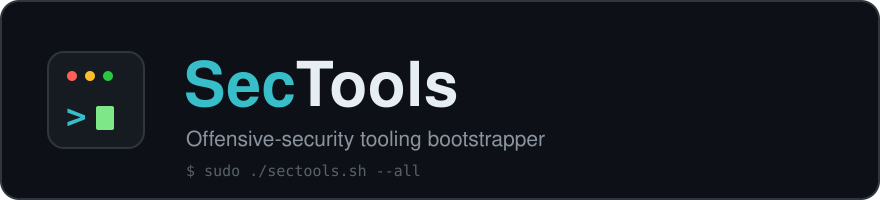

<p align="center">
  
</p>

<p align="center">
  
  
  
  <a href="https://github.com/0xstaark/SecTools/actions/workflows/shellcheck.yml"></a>
</p>

<p align="center">
  A single script that bootstraps a pentest workstation &mdash; installs common
  offensive-security tools, fetches a curated set of scripts and binaries, and
  adds a few shell quality-of-life helpers.
</p>

---

## Install

```bash
curl -fsSL https://raw.githubusercontent.com/0xstaark/SecTools/main/sectools.sh -o sectools.sh && chmod +x sectools.sh && sudo ./sectools.sh
```

This downloads the script to a file first so you can review it before running it
with root &mdash; recommended over piping straight into a shell. Prefer `wget`?

```bash
wget -q https://raw.githubusercontent.com/0xstaark/SecTools/main/sectools.sh
chmod +x sectools.sh && sudo ./sectools.sh
```

Requires a Debian-based distribution (built for **Kali**). `curl`, `wget`,
`unzip`, and `git` are pulled in automatically if missing.

## Usage

Run with no arguments for an interactive menu, or drive it non-interactively
with flags:

```bash
sudo ./sectools.sh --all -y                       # everything, unattended
sudo ./sectools.sh --tools --only netexec,impacket # a subset of tools
sudo ./sectools.sh --all --dry-run                 # preview, change nothing
sudo ./sectools.sh --list                          # list available tools
```

| Flag | Description |
| ---- | ----------- |
| `--tools` `--scripts` `--obfuscated` `--functions` | Run a phase (combine freely) |
| `--all` | Run every phase |
| `--dir PATH` | Download target (default `/opt/tools`) |
| `--only a,b` / `--skip a,b` | Install only / skip named tools |
| `--dry-run` | Show what would happen, change nothing |
| `--list` | Print the tool inventory and exit |
| `--update` / `--upgrade` | `apt update` / `apt upgrade` first |
| `-y, --yes` | Assume defaults (non-interactive) |
| `--no-color` | Plain output |
| `-h, --help` / `-V, --version` | Help / version |

Output auto-adapts to the terminal (colour, Unicode, `NO_COLOR`), each phase
ends with an `ok / skipped / failed` summary, and failures are recorded in
`sectools.log` in the launch directory.

## What it sets up

<details>
<summary><b>Tools</b> (apt on Kali, with pip/gem/GitHub-release fallbacks)</summary>

seclists · rustscan · wfuzz · ffuf · bloodhound · neo4j · gobuster ·
feroxbuster · certipy-ad · pypykatz · sublime-text · docker · docker-compose ·
bloodhound-CE · netexec · impacket · responder · mitm6 · evil-winrm ·
enum4linux-ng · ldapdomaindump · smbmap · pipx · fzf · bat · masscan · nuclei ·
httpx · subfinder · coercer · bloodyAD · ligolo-ng

`fzf` and `bat` are installed for the invoking user (not root); `bat` is aliased
to `cat` in `~/.zshrc` and `~/.bashrc`.
</details>

<details>
<summary><b>Scripts &amp; binaries</b> (downloaded to your tools directory)</summary>

**Windows / AD:** SharpHound, Rubeus, Certify, Seatbelt, Whisker, SharpMapExec,
SharpChisel, ADCSPwn, BetterSafetyKatz, PassTheCert, SharPersist, ADSearch,
SharpSCCM, Snaffler, mimikatz, Inveigh, nc.exe / nc64.exe, RunasCs, Rubeus,
PowerView, PowerUp, PowerUpSQL, LAPSToolkit, MailSniper, Invoke-Mimikatz,
Invoke-DCOM, Invoke-RunasCs, powercat

**Linux / privesc:** linpeas, winPEAS (x64 / any), pspy32 / pspy64,
linux-exploit-suggester, linuxprivchecker, LinEnum, chisel, PlumHound

**Release / repo:** kerbrute, PSTools, AutoRecon, PetitPotam, PassTheCert,
SprayingToolkit, BloodHound.py

**Obfuscated builds** (`--obfuscated`): the Flangvik ObfuscatedSharpCollection
set, saved to an `obfuscated/` sub-folder.
</details>

<details>
<summary><b>Shell helpers</b> (added to <code>~/.zshrc</code>)</summary>

- `servtools <port> [--obf]` &mdash; HTTP server from the tools directory
- `extract_ports <file>` &mdash; comma-separated port list from tool output
- `cat` aliased to `bat`/`batcat` when installed
- `rockyou.txt.gz` unzipped in place if present
</details>

## Disclaimer

For authorised security testing, research, and educational use only. You are
responsible for complying with all applicable laws and for having explicit
permission to test any system. The authors accept no liability for misuse.

## License

Released under the [MIT License](LICENSE).

<p align="center"><sub>Created by <a href="https://github.com/0xstaark">0xstaark</a></sub></p>
